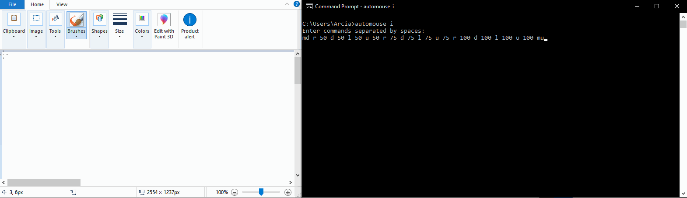

<p align="center">

</p>
<p align="center">
<a href="https://www.npmjs.com/package/automouse">

</a>
</p>

Control your mouse via CLI.

## Installation

```
npm install -g automouse
```

## Examples

```bash
automouse i
Enter commands separated by spaces:
md r 50 d 50 l 50 u 50 r 75 d 75 l 75 u 75 r 100 d 100 l 100 u 100 mu
```



## Usage

```
usage: automouse [command]

Commands:
interactive|i - starts interactive mode
version - displays the current version.
```

## Mouse Commands

Mouse commands are used in interactive mode to control the mouse. Commands are separated by spaces.

```
RIGHT|R - set direction to right.
LEFT|L - set direction to left.
UP|U - set direction to up.
DOWN|D - set direction to down.
LEFT-CLICK|CLICK|LC|C - click the left mouse button.
RIGHT-CLICK|RC - click the right mouse button.
MOUSE-DOWN|MD - toggle the mouse down.
MOUSE-UP|MU - toggle the mouse up.
MOUSE-DOWN-RIGHT|MDR - toggle the right mouse button down.
MOUSE-UP-RIGHT|MUR - toggle the right mouse button up.
[integer] - move the mouse in the current direction by this amount. example: "right 50" == move the mouse 50 pixels to the right.
```
